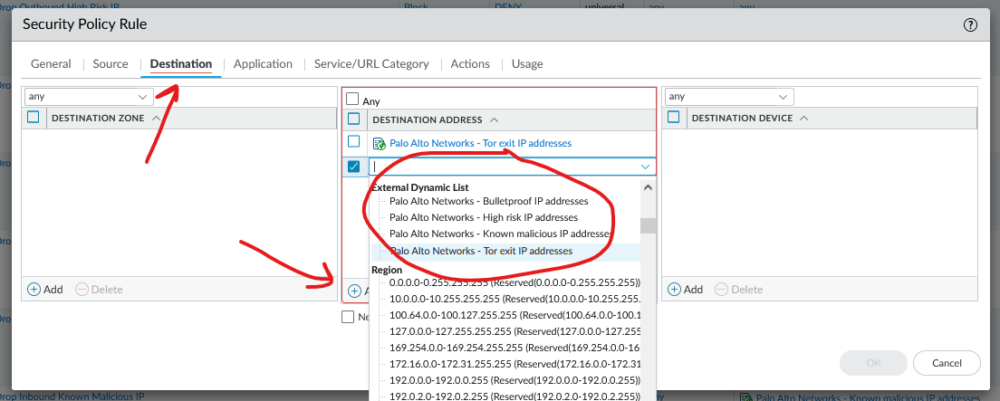

# Palo alto sine url filter
&nbsp;
##  Kvifor?

* Blokkerer kjende truslar: Stoppar trafikk til og frå skadelege eller kompromitterte IP-adresser.
* Sanntidsoppdateringar: Lister blir kontinuerleg oppdaterte med nye trusseldata frå Palo Alto eller tredjepart.
* Reduserer angrepsflata: Hindrar kontakt med botnet, farlege serverar og andre uønskte nettressursar.

## Korleis?

Policies > Security > Add

### Regel
| Fra | Applikasjon/Service/Port | Til | Aksjon |
|-----|---|---|---|
| Any | Any | Palo IP lister | Block |
| Palo IP lister | Any | Any | Block |

Dette gjentas for alle eksterne listene både som destination og source:

**Her blir all trafikk ut og inn som snakkar med desse IP addressee blokert**

## Resursar
https://docs.paloaltonetworks.com/network-security/security-policy/administration/objects/external-dynamic-lists/built-in-edls'