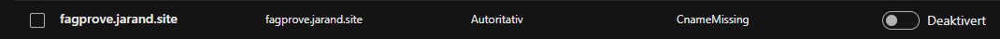
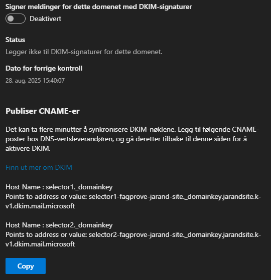

# Legge inn eige domene i entra
&nbsp;
## Kva og kvifor
Her blir domenet sikra med SPF, DKIM og DMARC
* SPF, DKIM og DMARC beskyttar domenet ditt mot misbruk som spam og phishing:
* SPF bestemmer kva serverar som kan sende e-post frå domenet ditt.
* DKIM legg til ein digital signatur som verifiserer at e-posten er ekte og ikkje endra.
* DMARC gir reglar for korleis e-post som feilar sjekkar skal handterast, dette bidrar til å forhindre falske avsendere som
brukes i e-postkompromisser for bedrifter, løsepengevirus og andre phishing-angrep.

Dette aukar tryggleiken og tilliten til e-postar frå domenet ditt.

## Korleis

### Aktivere SPF

Dette blir gjort i fyrste del av å legge til domene [Eige domene](../Tilpasse%20eigen%20tennant/Eige%20domene/Nytte%20eige%20domene.md)

### Aktivere DKIM 
Logg inn i microsoft defender og naviger deg til DKIM innstillinger:
https://defender.microsoft.com > Epost og sammarbeid > Policyer og regler > Trusselpolicyer > Innstillinger for e-postgodkjenning

Gå til DKIM menyen og trykk på veksleknappen. (Dette kan du og gjer på onmicrosoft domenet ditt)

Trykker du på domenet du kan få opp DKIM DNS oppføringane som skal leggast inn hjå DNS leverandør.

Legg inn oppføringane som du får frå defender og aktiver DKIM

### Aktivere DMARC 
Legg inn DMARC oppføringa under, sjå [resursar](#resusrsar) for kva oppføringa skal vere.

### Sluttresultat

Totalt må ein opprette følgane DNS oppføringar og domene skal vere litt sikrare:
| Teneste | Type | Navn | Endepunkt/Verdi | TTL |
|-----|---|---|---|---|
| SPF | TXT | fagprove.jarand.site | v=spf1 include:spf.protection.outlook.com -all | auto |
| DKIM | CNAME | selector1._domainkey.fagprove.jarand.site | selector1-fagprove-jarand-site._domainkey.jarandsite.k-v1.dkim.mail.microsoft | auto |
| DKIM | CNAME | selector2._domainkey.fagprove.jarand.site | selector2-fagprove-jarand-site._domainkey.jarandsite.k-v1.dkim.mail.microsoft | auto |
| DMARC | TXT | _dmarc.fagprove.jarand.site | v=DMARC1; p=reject; pct=100; rua=mailto:rua@fagprove.jarand.site; ruf=mailto:ruf@fagprove.jarand.site | auto |

### Tips
DU kan nytte dns checker (https://dnschecker.org/) for å sikre deg at domenenavna er synca global og at defender kan sjp DNS oppføringane dine

## Resusrsar
https://learn.microsoft.com/nb-no/defender-office-365/email-authentication-spf-configure#spf-txt-records-for-custom-domains-in-microsoft-365

https://learn.microsoft.com/en-us/defender-office-365/email-authentication-dkim-configure#syntax-for-dkim-cname-records

https://learn.microsoft.com/nb-no/defender-office-365/email-authentication-dmarc-configure#syntax-for-dmarc-txt-records

**Sjekke at DNS records er synkronisert dil diverse dns serverar**

https://dnschecker.org/